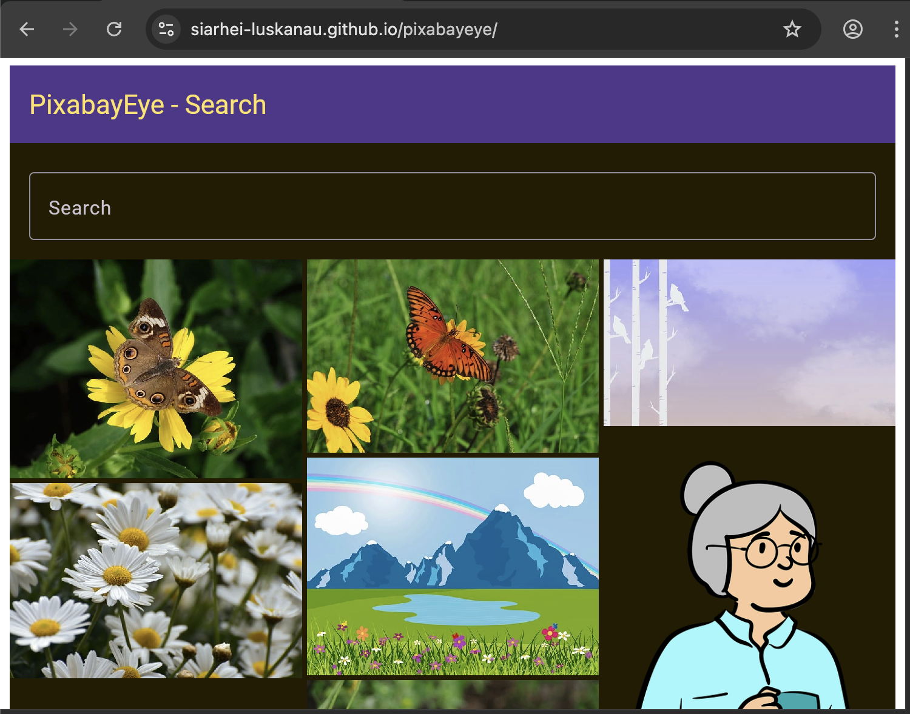

# 🌎 PixabayEye - Cross-Platform Image Search app with Kotlin Multiplatform


---

## ✨ Introduction

**PixabayEye** is a modern, lightweight application designed to showcase the power of **Kotlin Multiplatform** for real-world app development.  
With a single codebase, developers can efficiently target **Android, iOS, Web, and Desktop** — dramatically reducing development time and maintenance efforts.  
Built with love for developers who believe in writing code once and deploying everywhere! 🚀

---

## 🔥 Key Features

- ⚡ **Cross-Platform Compatibility**: Android, iOS, Web (browser), and Desktop (JVM).
- 💬 **Shared Logic**: Core modules for UI, networking, and data management.
- 📚 **Modern Libraries Integration**:
    - **Compose Multiplatform** for seamless UI across devices.
    - **Ktor** for efficient networking.
- 🛠 **Custom Gradle Convention Plugins**: Simplify Kotlin Multiplatform project structure.
- 📸 **Screenshot Testing**: Roborazzi with Robolectric enables screenshot testing.

---

## 🚀 Getting Started

### Prerequisites

- **JDK 17** installed
- **Android SDK** set in `local.properties`
- **[KDoctor](https://github.com/Kotlin/kdoctor)** to verify environment
- **Xcode** (for iOS) and **Android Studio** (for Android/Web/Desktop)

### Setup

```bash
git clone https://github.com/siarhei-luskanau/pixabayeye.git
cd pixabayeye
./gradlew doctor
```

Create a `local.properties` file with:

```properties
sdk.dir=/path/to/your/Android/Sdk
```

---

## 🛠 Running the App

### Android
To run the application on android device/emulator:
- open project in Android Studio and run imported android run configuration

To build the application bundle:
- run `./gradlew :app:androidApp:assembleDebug :app:androidApp:assembleRelease`
- find `.apk` file in `app/androidApp/build/outputs/apk/debug/androidApp-debug.apk`
- Run android UI tests on the connected device: `./gradlew :app:androidApp:managedVirtualDeviceDebugAndroidTest :composeApp:managedVirtualDeviceAndroidDeviceTest -Pandroid.testoptions.manageddevices.emulator.gpu=swiftshader_indirect`

### Desktop
Run the desktop application: `./gradlew :app:desktopApp:run`  
Run desktop UI tests: `./gradlew jvmTest`

### iOS
To run the application on iPhone device/simulator:
- Open `iosApp/iosApp.xcproject` in Xcode and run standard configuration
- Or use [Kotlin Multiplatform Mobile plugin](https://plugins.jetbrains.com/plugin/14936-kotlin-multiplatform-mobile) for Android Studio
  Run iOS simulator UI tests: `./gradlew iosSimulatorArm64Test`

### Web Distribution
Build web distribution: `./gradlew :app:webApp:composeCompatibilityBrowserDistribution`  
Deploy a dir `app/webApp/build/dist/composeWebCompatibility/productionExecutable` to a web server

### Wasm Browser
Run the browser application: `./gradlew :app:webApp:wasmJsBrowserDevelopmentRun`  
Run browser UI tests: `./gradlew :app:webApp:wasmJsBrowserTest`

### Screenshot Testing
Record a screenshot: `./gradlew recordRoborazziAndroidHostTest -DIS_DATA_STUB_ENABLED=true`
Output directory is `screenshots/`

---

## 🤝 Contributing

We welcome contributions!

1. Fork the repo 🍴
2. Create your feature branch (`git checkout -b feature/YourFeature`)
3. Commit your changes (`git commit -m 'Add some feature'`)
4. Push to the branch (`git push origin feature/YourFeature`)
5. Open a Pull Request 🚀

You can also create [issues](https://github.com/siarhei-luskanau/pixabayeye/issues) for bug reports, discussions, or feature requests.

---

## 📜 License

This project is licensed under the **MIT License** — see the [LICENSE](https://github.com/siarhei-luskanau/pixabayeye/blob/main/LICENSE) file for details.

---

## 📸 Screenshots

| Android | iOS | Desktop | Web |
|:-------:|:---:|:-------:|:---:|
|  |  |  |  |

---

## 🌟 Call to Action

If you find **PixabayEye** useful or inspiring,  
please ⭐ **star this repository** to support the project and help it grow!  
Let's make cross-platform development easier, faster, and more fun together! 🚀
